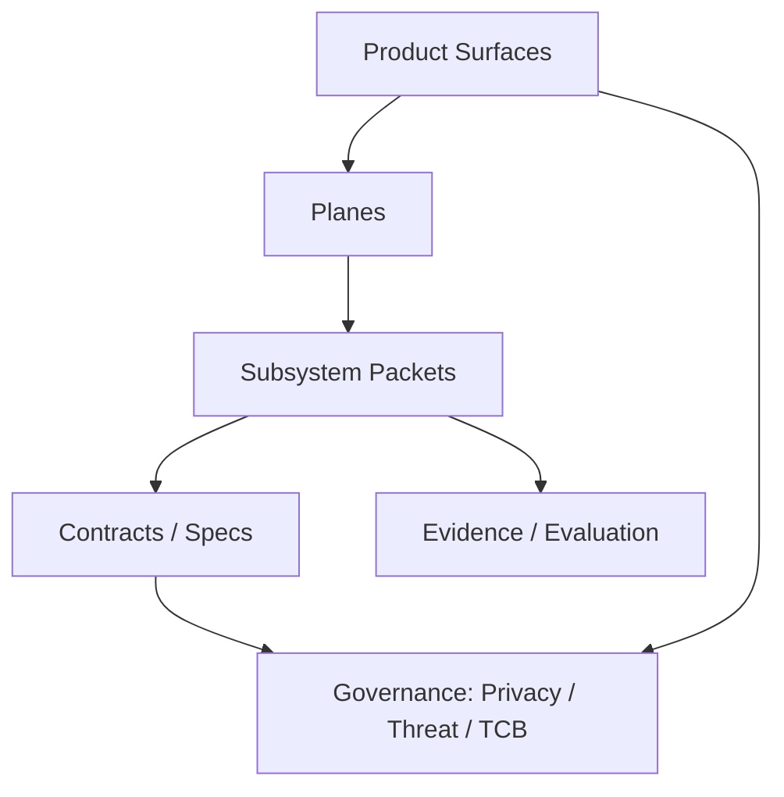

# System Map
DOC-ID: SYS-00
Status: Specified only / roadmap

This page is the primary navigation hub for the Goni blueprint. It connects
product surfaces, planes, contracts/specs, governance, and evidence.

## Start here
- [Goni Story](/blueprint/docs/goni-story.md)
- [Goni Whitepaper](/blueprint/docs/goni-whitepaper.md)
- [Glossary](/blueprint/docs/glossary.md)
- [Architecture index](/blueprint/docs/ARCHITECTURE.md)

## Hubs
- [Docs rules](/blueprint/docs/01-docs-rules.md)
- [Taxonomy and IDs](/blueprint/docs/02-taxonomy-and-ids.md)
- [Hubs index](/blueprint/docs/hubs/00-index.md)
- [System lane](/blueprint/20-system/00-index.md)
- [Performance realism](/blueprint/20-system/30-performance.md)
- [Agentic kernel foundations](/blueprint/20-system/40-agentic-kernel-foundations.md)
- [Kernel-blockchain mapping](/blueprint/20-system/45-kernel-blockchain-mapping.md)

## Planes and contracts
- [Planes hub](/blueprint/docs/hubs/planes.md)
- [Contracts hub](/blueprint/docs/hubs/contracts.md)
- [Governance hub](/blueprint/docs/hubs/governance.md)
- [Product surfaces hub](/blueprint/docs/hubs/product-surfaces.md)

## Tracks
- [Hardware overview](/blueprint/hardware/00-overview.md)
- [Software overview](/blueprint/software/00-overview.md)
- [Runtime overview](/blueprint/runtime/00-overview.md)
- [Security overview](/blueprint/security/00-overview.md)
- Prototype catalog: goni-prototype-lab:prototype/00-index.md

## Evidence and traceability
- goni-prototype-lab:goni-lab/TRACEABILITY.md
- [EVALUATION](/blueprint/docs/EVALUATION.md)
- [Receipts hub](/blueprint/docs/receipts/00-index.md)

## System map sketch (doc graph)

