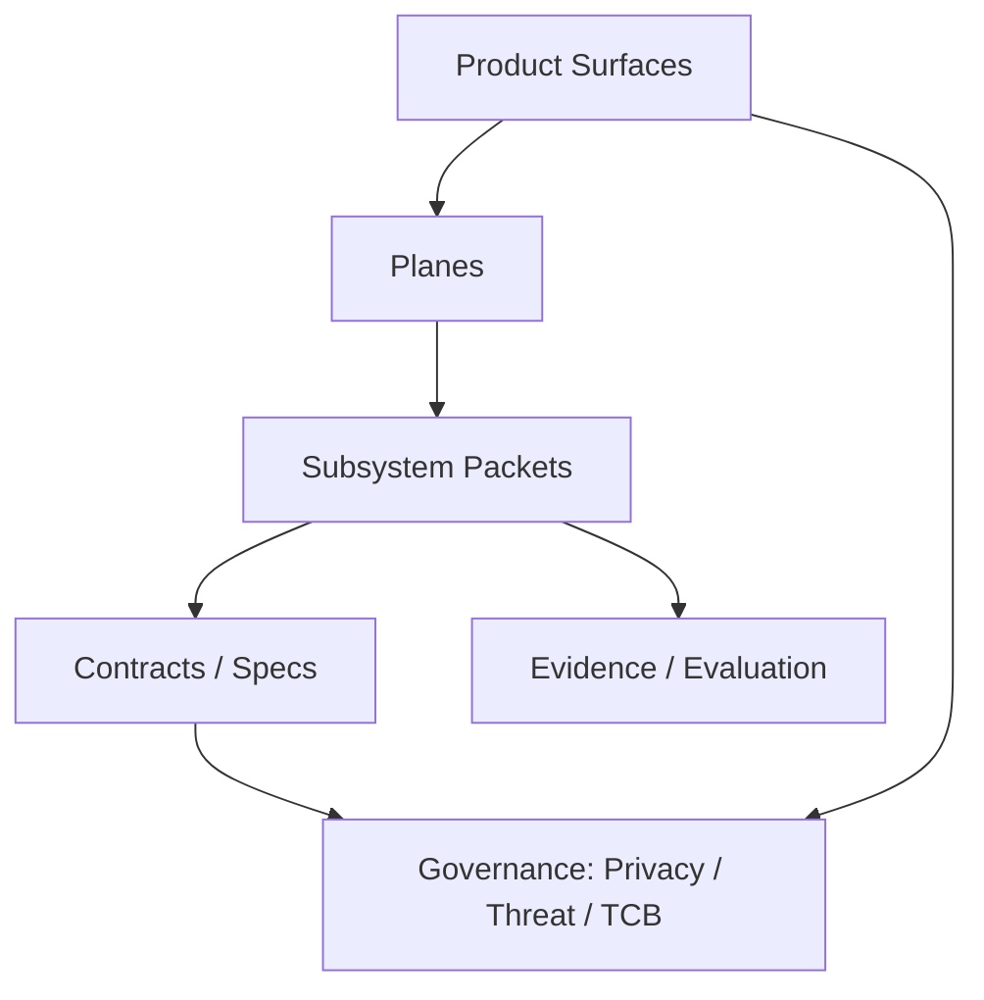

# System Map
DOC-ID: SYS-00
Status: Specified only / roadmap

This page is the primary navigation hub for the Goni blueprint. It connects
product surfaces, planes, contracts/specs, governance, and evidence.

## Start here
- [Goni Story](./goni-story.md)
- [Goni Whitepaper](./goni-whitepaper.md)
- [Glossary](./glossary.md)
- [Architecture index](./ARCHITECTURE.md)

## Hubs
- [Docs rules](./01-docs-rules.md)
- [Taxonomy and IDs](./02-taxonomy-and-ids.md)
- [Hubs index](./hubs/00-index.md)

## Planes and contracts
- [Planes hub](./hubs/planes.md)
- [Contracts hub](./hubs/contracts.md)
- [Governance hub](./hubs/governance.md)
- [Product surfaces hub](./hubs/product-surfaces.md)

## Tracks
- [Hardware overview](../hardware/00-overview.md)
- [Software overview](../software/00-overview.md)
- [Runtime overview](../runtime/00-overview.md)
- [Security overview](../security/00-overview.md)
- [Prototype catalog](../prototype/00-index.md)

## Evidence and traceability
- [TRACEABILITY](./TRACEABILITY.md)
- [EVALUATION](./EVALUATION.md)
- [Receipts hub](./receipts/00-index.md)

## System map sketch (doc graph)

