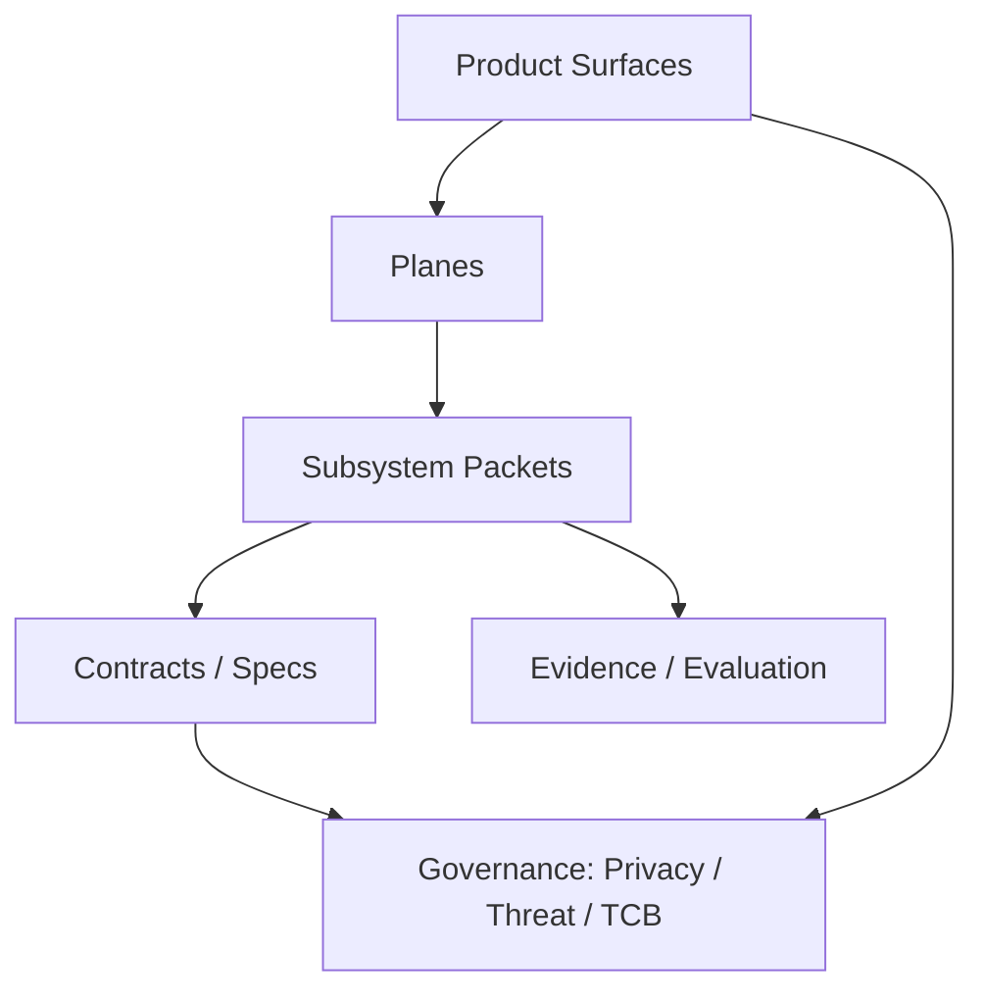

# System map sketch (doc graph)

> Status boundary: this is a migrated draft. For `specified_only` nodes, present-tense or enforcement language below states intended contract behavior, not observed implementation, verification, or non-bypassability.

## System map sketch (doc graph)

