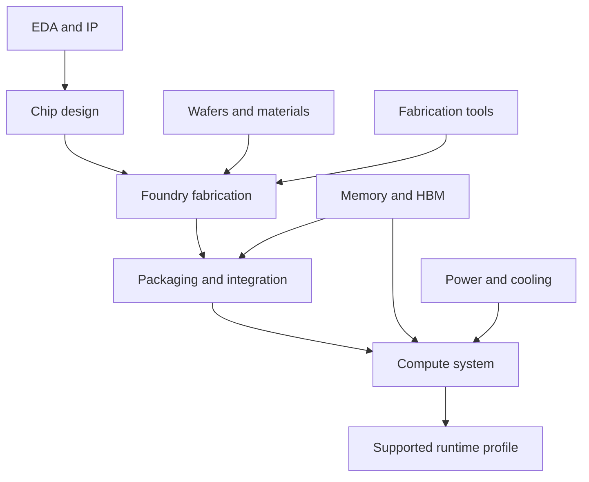

# Physical dependencies of cooperative compute

> Status boundary: this is a specified-only blueprint contract or planned evaluation.

This reading guide links [HCOMP-01](../principles/hcomp-01-semantic-universality-physical-specialization.md),
[COMP-REG-01](../specifications/comp-reg-01-compute-capability-registry.md), the
[existing hardware requirements](../specifications/goni-spec-5819106486b4-3-1-compute-capability.md),
and the [dated supplier map](../implementation-maps/goni-imap-c4d26460e574-25-hardware-layers-and-supplier-map-2025-2026.md).

## Dependency model

The proposal's EDA → Wafer → FabTools → Foundry → Packaging/HBM → System shorthand
is interpreted as a dependency graph, rather than a single production sequence:

This is an explanatory dependency model. It makes no new supplier, availability,
or market-share claims. Vendor facts remain dated and sourced in implementation
maps. A chip's existence, a purchasable system, a supported runtime, and a measured
GONI workload are separate readiness milestones.

The memory/interconnect → useful compute shorthand describes a workload
constraint, not a universal causal ordering. COMP-REG-01 and the existing
telemetry contract provide the placement-facing descriptions; empirical
performance and evidence costs belong to scoped evaluation results.
