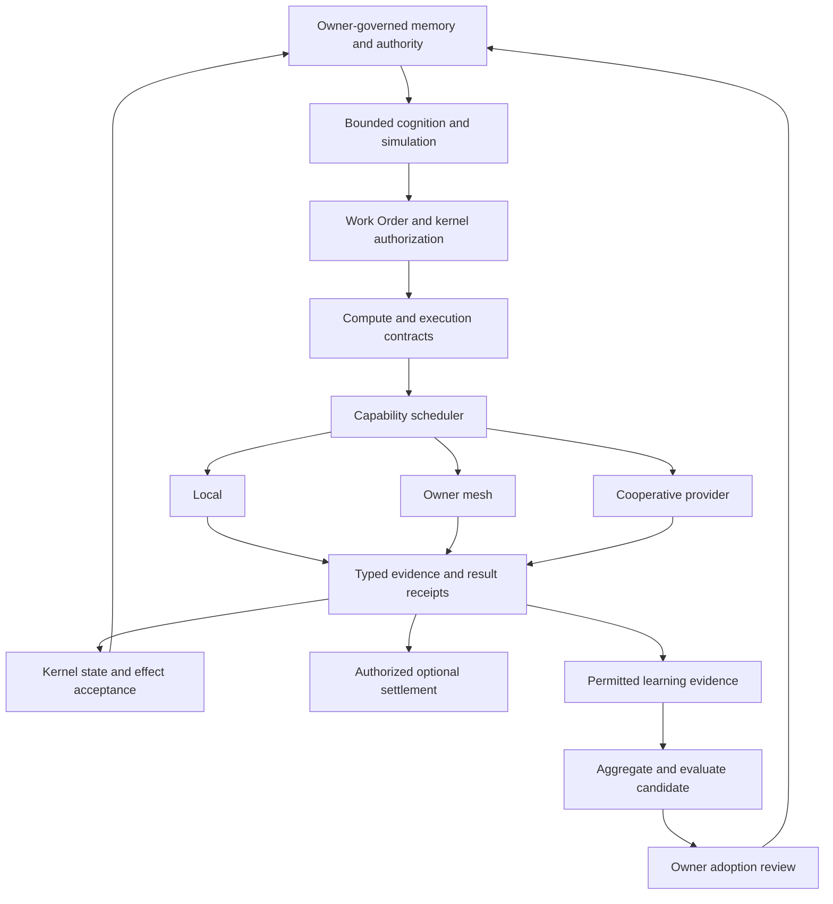

# Sovereign cooperative architecture — five responsibilities

> Status boundary: this is a specified-only blueprint contract or planned evaluation.

The governing thesis is [D-025](../decisions/D-025-sovereign-cooperative-compute.md):

> GONI keeps identity, memory and authority sovereign; computation and evidence
> may scale cooperatively.

This synthesis is a reading guide. The linked atomic nodes own the contracts and
formal definitions. These five responsibilities span the existing Data, Context,
Control, and Execution planes; they introduce neither five replacement planes
nor five independent authority or persistence systems.

## Five responsibilities

| Responsibility | Canonical homes | Architectural role |
|---|---|---|
| Sovereignty and disclosure | D-025, NET-01, NET-COMP-01 | Principal-owned state, owner-mesh enrollment, recipient-scoped exports and disclosure policy. |
| Computation and evidence | JOB-01, COMP-01, EXEC-01, EVID-01, RESULT-01, DIST-01 | Scheduler-visible work, computation identity, execution terms, typed assurance, receipts and acceptance. |
| Cognition and deliberation | WORLD-01, DREAM-01, EPI-CTRL-01, LOSS-01, SIM-BUDGET-01 | Bounded beliefs, predictive dynamics, consequence-sensitive decisions and marginal simulation value. |
| Placement and hardware | SCHED-01, COMP-REG-01, HCOMP-01 | Capability-qualified eligible routes and full-system cost across physically specialized resources. |
| Cooperative improvement | NET-LEARN-01, SYS-03 | Shareable evidence, lineage-aware aggregation, evaluated candidates and locally authorized adoption. |

## Twenty-point navigation map

The numbering preserves the 4 October proposal. Each row identifies its
authoritative home; conceptual notation is defined or qualified there.

| Point | Meaning | Home |
|---|---|---|
| 1 | Sovereign node, cooperative computation | [D-025](../decisions/D-025-sovereign-cooperative-compute.md) |
| 2 | Universal compute envelope beneath scheduler-visible work | [UCT-01 composition](verified-compute-substrate.md#universal-compute-transition-uct-01), [COMP-01](../specifications/comp-01-computation-specification.md) |
| 3 | Execution returns output, proposed state, metering and evidence | [UCT-01](verified-compute-substrate.md#universal-compute-transition-uct-01), [EXEC-01](../specifications/exec-01-execution-contract.md), [RESULT-01](../specifications/result-01-computation-result-receipt.md) |
| 4 | Computation identity and separately bound execution terms | [COMP-01](../specifications/comp-01-computation-specification.md), [EXEC-01](../specifications/exec-01-execution-contract.md) |
| 5 | Exact, approximate, and stochastic execution semantics | [COMP-01](../specifications/comp-01-computation-specification.md#execution-semantics) |
| 6 | Evidence mechanisms with scoped claims and assumptions | [EVID-01](../specifications/evid-01-computation-evidence-contract.md) |
| 7 | Task-scoped belief representation | [WORLD-01](../specifications/world-01-bounded-predictive-world-model.md) |
| 8 | Predictive dynamics and observation likelihood | [WORLD-01](../specifications/world-01-bounded-predictive-world-model.md) |
| 9 | Decision value within permitted actions | [WORLD-01](../specifications/world-01-bounded-predictive-world-model.md#planning-integration), [LOSS-01](../specifications/loss-01-consequence-sensitive-decision-control.md) |
| 10 | Marginal value of additional bounded simulation | [SIM-BUDGET-01](../specifications/sim-budget-01-decision-aware-simulation-allocation.md) |
| 11 | Capability requirements and eligibility | [COMP-REG-01](../specifications/comp-reg-01-compute-capability-registry.md) |
| 12 | Full-system placement objective | [COMP-REG-01](../specifications/comp-reg-01-compute-capability-registry.md#eligibility-and-placement) |
| 13 | Scoped operation/resource/trust/evidence advertisements | [COMP-REG-01](../specifications/comp-reg-01-compute-capability-registry.md#capability-description) |
| 14 | Owner mesh and independent-provider authority domains | [NET-COMP-01](../specifications/net-comp-01-cooperative-compute-export.md#trust-domains) |
| 15 | Recipient- and purpose-scoped export compilation | [NET-COMP-01](../specifications/net-comp-01-cooperative-compute-export.md#export-contract) |
| 16 | Threat-model-scoped disclosure/leakage boundary | [NET-COMP-01](../specifications/net-comp-01-cooperative-compute-export.md#leakage-claim), [NET-01](../specifications/net-01-net-01-network-gate-and-anonymity.md) |
| 17 | Canonical computation result receipts | [RESULT-01](../specifications/result-01-computation-result-receipt.md), [REC-01](../specifications/rec-01-receipts-rec-01.md) |
| 18 | Compute, evidence verification, canonicality, and settlement | [DIST-01](../principles/dist-01-validity-availability-canonicality.md), [EXEC-01](../specifications/exec-01-execution-contract.md) |
| 19 | Cooperative evidence to evaluated candidate improvements | [NET-LEARN-01](../specifications/net-learn-01-collective-evidence-learning.md) |
| 20 | Semantic universality, physical specialization and dependencies | [HCOMP-01](../principles/hcomp-01-semantic-universality-physical-specialization.md), [hardware dependencies](hardware-compute-dependencies.md) |

## Composition and authority

Authorized private context supports bounded cognition. A candidate Work Order
enters the existing kernel authority path before execution terms or placement
are accepted. The scheduler selects a contract-qualified local, owner-mesh, or
cooperative route. Returned output, proposed state, metering and evidence pass
their separate acceptance checks and canonical receipts. Current kernel
authority determines state/effect adoption; settlement applies only under its
explicit authorized execution terms.

CPU/GPU/NPU are current hardware-profile subjects. Crypto/proof/FPGA/remote/QPU
possibilities remain qualified profile extensions under HCOMP-01 and COMP-REG-01.
The existing MVP scope is retained.

## Objections and evaluation path

Read [COOP-PRIVACY-01](../objections/coop-privacy-01-export-composition-risk.md),
[WORLD-MODEL-RISK-01](../objections/world-model-risk-01-model-relative-certainty.md),
and [COOP-LEARNING-RISK-01](../objections/coop-learning-risk-01-correlated-and-poisoned-evidence.md)
alongside the corresponding contracts.

The five planned evaluations are [EXPORT-EVAL-01](../experiments/export-eval-01-sovereign-export-boundaries.md),
[COMPUTE-EVAL-01](../experiments/compute-eval-01-universal-transition-conformance.md),
[WORLD-EVAL-01](../experiments/world-eval-01-predictive-deliberation.md),
[PLACEMENT-EVAL-01](../experiments/placement-eval-01-capability-qualified-placement.md),
and [NET-LEARN-EVAL-01](../experiments/net-learn-eval-01-collective-evidence-adoption.md).
Evaluations accompany each implementation stage. Experimental code remains in
the existing experimental repositories; outcome evidence is introduced only
after scoped runs and full implementation/test revisions are available.

All nodes remain draft. This synthesis asserts neither runtime implementation,
calibrated world models, confidential outsourced execution, nor a validated
cooperative compute market.
